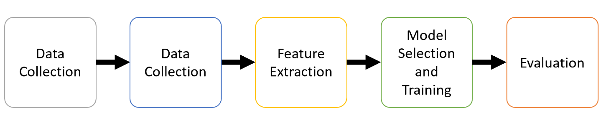
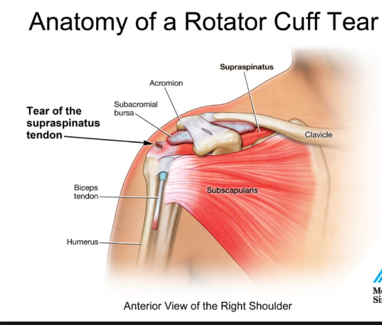
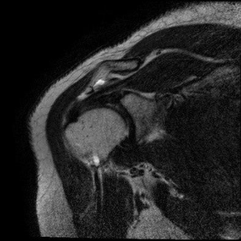

# GUGC Bachelor Project:
<h2> "EXPLORING WEB-BASED MACHINE LEARNING FOR ROTATOR CUFF TEAR DIAGNOSIS IN MAGNETIC RESONANCE IMAGES" </h2>

<h3> 
  <b> Student: </b> Ju Hyung Lee  
  <b> Supervisor: </b> Prof. Dr. Wesley De Neve  
  <b> Counsellors: </b> Mijung Kim, Homin Park  
</h3>

<h2> Project Description </h2>

  <b> This project has two main goals: <b>

 1. Implement Machine Learning to train a model to classify Rotator Cuff Disease from MRI images 

 2. Visualize the model above by builing a Graphical User Interface (GUI)

<h2> Pipeline of Machine Learning </h2>
  
  

    ML implementation starts with Data Collection, followed by preprocessing of data including augmentation and normalization of given data. After preprocessing, feature extraction is done with Principal Component Analysis (PCA) to reduce the number of variables. The dataset then is used to train classification models – AdaBoost and KNN – and their performance after training will be evaluated.
  

<h2> Disease: Rotator Cuff Disease </h2>

<style src='css'>

 
  Particularily, I will be examining MRI images of human shoulder. Moreover, from the MRI image, I will only 
  observe the Supraspinatus tendons region. It is one of the group of shoulder muscles/tendons - altogether
  referrring to "Rotator Cuff" - that act to stabilize the shoulder. If the patient suffers from supraspinatus 
  tendons tearing, a white spot will appear in the MRI image.

<h2> Deep Learning Implementation </h2>

<h3> Samples information </h3>

 MRI images were obtained from archive in a hospital: 2643 patients, 16 MRI images of shoulder per patient. 

<h3> Image augmentation </h3>

 In order to increase sample size, different modifications were done to image: 

<pre>

 1. Flip (vertical, horizontal) 

 2. Gaussian Noise 

 3. Contrast 
 

 4. Scaling 
 

 5. Gamma Correction 

 6. Gaussian Blur 
 

 7. Rotation 

 8. Shearing 

</pre>

 
  

